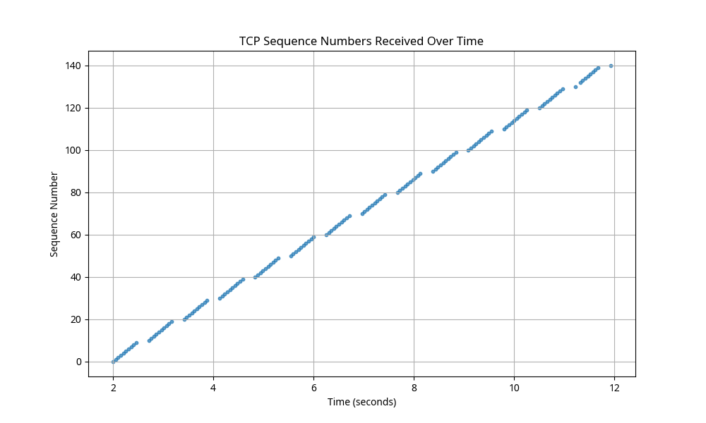
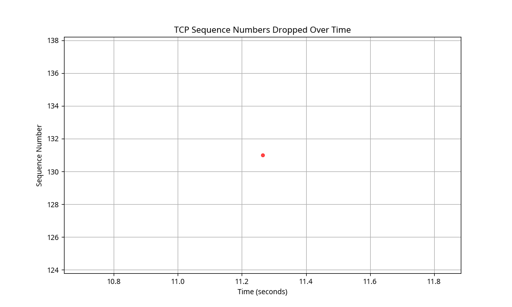

# TCP Client-Server Implementation

## CS 258 Project Assignment
### Team Member: Xiangyi Li

## Project Overview

This project implements a TCP client-server application that demonstrates the core concepts of the TCP Sliding Window protocol, including:

- Reliable data transfer through sequence numbers and acknowledgments
- Flow control through sliding window mechanism
- Handling of packet loss through retransmission
- Performance monitoring through goodput calculation

## Features

- **TCP Server**: Implements passive listening mode, connection setup, sequence number processing, missing packet tracking, and goodput calculation
- **TCP Client**: Implements connection initiation, sliding window protocol, ACK processing, packet drop simulation (1%), and retransmission
- **Performance Metrics**: Tracks and visualizes window size changes, sequence numbers, packet drops, and goodput
- **Comprehensive Testing**: Includes test scripts to verify all functionality

## Repository Structure

```
.
├── server.py                  # TCP server implementation
├── client.py                  # TCP client implementation
├── documentation.md           # Detailed project documentation
├── test_tcp.py                # Test script for client-server communication
├── graphs/                    # Performance visualizations
│   ├── sender_window_size.png # TCP sender window size over time
│   ├── sequence_numbers_received.png # Sequence numbers received over time
│   ├── sequence_numbers_dropped.png  # Sequence numbers dropped over time
│   ├── performance_summary.txt       # Overall performance metrics
│   └── retransmission_stats.txt      # Retransmission statistics
└── test_results/              # Test output logs
```

## Installation

1. Clone the repository:
```bash
git clone https://github.com/kookiemaster/tcp-client-server-project.git
cd tcp-client-server-project
```

2. Ensure Python 3.6+ is installed:
```bash
python3 --version
```

3. Install required dependencies:
```bash
pip3 install matplotlib numpy
```

## Usage

### Running the Server

```bash
python3 server.py
```

The server will start in passive listening mode on port 12347 (default).

### Running the Client

```bash
python3 client.py
```

The client will connect to the server, send an initial string, and begin transmitting packets using the sliding window protocol.

### Running the Test Script

For a complete test of the client-server communication:

```bash
python3 test_tcp.py
```

This script will:
1. Start the server in a separate process
2. Connect the client to the server
3. Transmit packets with the sliding window protocol
4. Simulate packet drops and retransmissions
5. Collect performance data
6. Generate visualizations

## Visualizations

### TCP Sender Window Size Over Time


This graph shows how the TCP sender's window size changes over time during transmission. The window size increases as packets are successfully acknowledged, demonstrating the dynamic nature of the sliding window protocol.

### TCP Sequence Numbers Received Over Time



This graph shows the sequence numbers received by the server over time. The linear progression indicates successful and orderly packet delivery.

### TCP Sequence Numbers Dropped Over Time



This graph shows the sequence numbers that were dropped during transmission, demonstrating the packet drop simulation working as expected.

## Performance Metrics

The test results show:

- Server IP Address: 127.0.0.1
- Client IP Address: 127.0.0.1
- Total Packets Sent: 140
- Total Packets Received: 140
- Packets Dropped: 1
- Overall Goodput: 1.0000

Window Size Statistics:
- Initial Window Size: 10
- Final Window Size: 131
- Average Window Size: 74.36

## Documentation

For detailed information about the implementation, please refer to the [documentation](documentation.md).

## Requirements Verification

All project requirements have been verified and met. For a detailed verification checklist, see [requirements_verification.md](requirements_verification.md).

## Future Improvements

For a more comprehensive implementation, the following improvements could be considered:

1. Implementation of congestion control mechanisms (slow start, congestion avoidance)
2. Variable timeout calculation based on RTT measurements
3. Support for out-of-order packet delivery
4. Implementation of selective acknowledgments (SACK)
5. Testing with larger packet counts and over real network conditions
