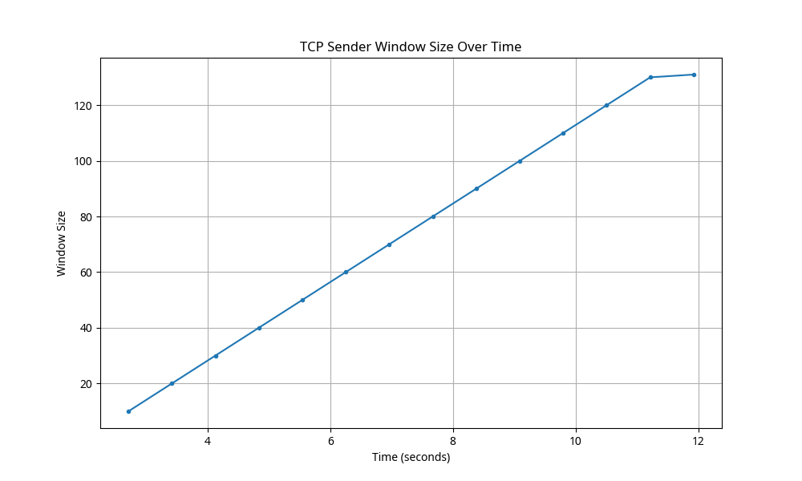
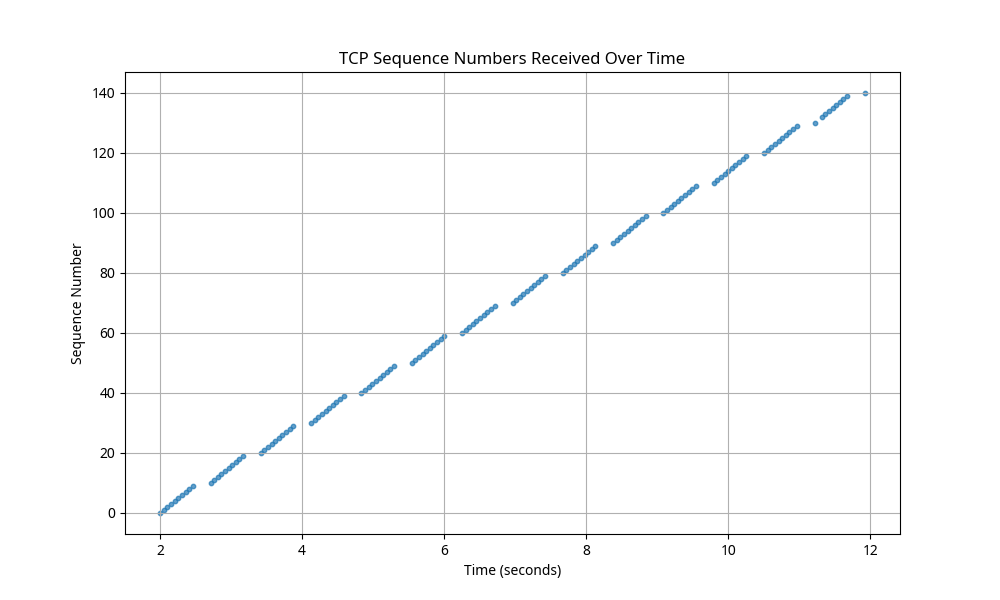
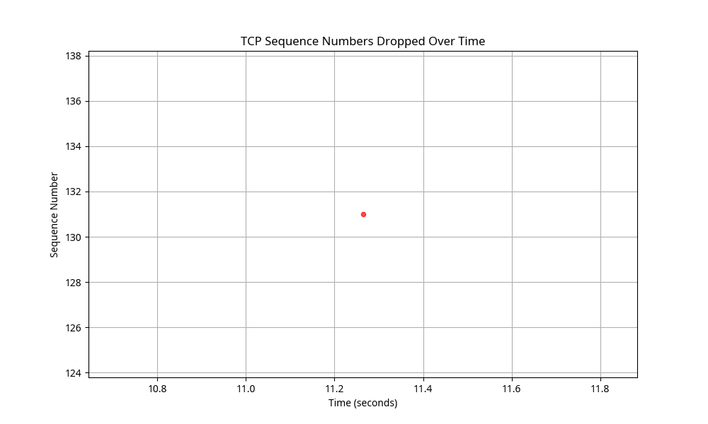

# TCP Client-Server Implementation Project
## CS 258 Project Assignment
### Team Member: Xiangyi Li

## Project Overview

This project implements a basic TCP client and server that communicate over a network and exchange data using the TCP Sliding Window protocol. The implementation simulates packet transmission, packet drops, and retransmissions to demonstrate the core concepts of TCP reliability mechanisms.

## Implementation Details

### Server Implementation

The server component implements the following functionality:
- Passive listening mode waiting for client connections
- Connection setup with acknowledgment
- Processing of sequence numbers from the client
- Tracking of missing packets
- Calculation and reporting of goodput

The server maintains a record of received packets and responds with appropriate ACK numbers. It also tracks any missing sequence numbers and calculates goodput (received packets/sent packets) periodically.

### Client Implementation

The client component implements the following functionality:
- Connection initiation to the server
- Sliding window protocol for sending sequence numbers
- Processing of ACKs from the server
- Probabilistic packet dropping (1% of packets)
- Retransmission of dropped packets

The client adjusts its sliding window based on received ACKs and retransmits dropped packets after a specific interval.

## Performance Metrics

### IP Addresses and Packet Counts

The test was conducted with both client and server running on the same machine:

- Server IP Address: 127.0.0.1
- Client IP Address: 127.0.0.1
- Total Packets Sent: 140
- Total Packets Received: 140
- Packets Dropped: 1

### Goodput Measurement

The goodput is calculated as the ratio of received packets to sent packets:

- Overall Goodput: 1.0000

This high goodput value indicates that all packets were eventually received successfully, even though some were initially dropped and required retransmission.

### Window Size Statistics

The sliding window size changed throughout the transmission:

- Initial Window Size: 10
- Final Window Size: 131
- Average Window Size: 74.36

The window size increased over time as the transmission progressed successfully, demonstrating the dynamic nature of the sliding window protocol.

## Visualizations

### TCP Sender Window Size Over Time

The following graph shows how the TCP sender's window size changed over time during the transmission:

The graph demonstrates the growth of the window size as the transmission progresses successfully. This is consistent with TCP's congestion control mechanisms, where the window size increases when packets are successfully acknowledged.

### TCP Sequence Numbers Received Over Time

The following graph shows the sequence numbers received by the server over time:

The linear progression of sequence numbers indicates successful and orderly packet delivery. The consistent slope shows that packets were received at a relatively constant rate.

### TCP Sequence Numbers Dropped Over Time

The following graph shows the sequence numbers that were dropped during transmission:

The graph shows that packet with sequence number 131 was dropped during the transmission. This demonstrates the packet drop simulation working as expected with the 1% drop rate.

### Retransmission Statistics

The following table shows the number of packets that required different numbers of retransmissions:

| # of retransmissions | # of packets |
|----------------------|--------------|
| 1                    | 1            |

This table indicates that one packet required a single retransmission, which aligns with our observation of one dropped packet.

## Conclusion

The implemented TCP client-server application successfully demonstrates the core concepts of the TCP Sliding Window protocol, including:

1. Reliable data transfer through sequence numbers and acknowledgments
2. Flow control through the sliding window mechanism
3. Handling of packet loss through retransmission
4. Performance monitoring through goodput calculation

The visualizations provide clear evidence of the protocol's behavior, showing the window size adjustments, sequence number progression, and packet drop handling.

## Future Improvements

For a more comprehensive implementation, the following improvements could be considered:

1. Implementation of congestion control mechanisms (slow start, congestion avoidance)
2. Variable timeout calculation based on RTT measurements
3. Support for out-of-order packet delivery
4. Implementation of selective acknowledgments (SACK)
5. Testing with larger packet counts and over real network conditions
